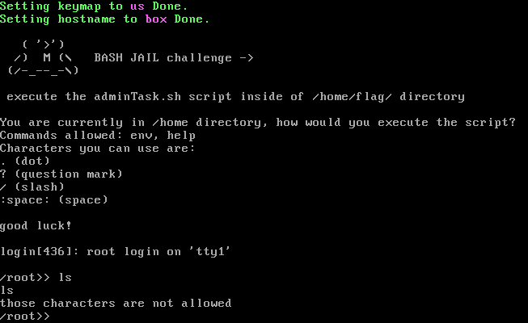

# descon_2022_challenge_by_mirko
My ctf challenge made for Descon 2022 conference

## "bash jail" made by mirko
  
Challenge consists of a .iso disk image - my custom Operating System consisting of linux kernel, isolinux bootloader and bash_jail init process.
 

 
 
Text of the challenge is written in the machine, if you want to solve it, download it :)
